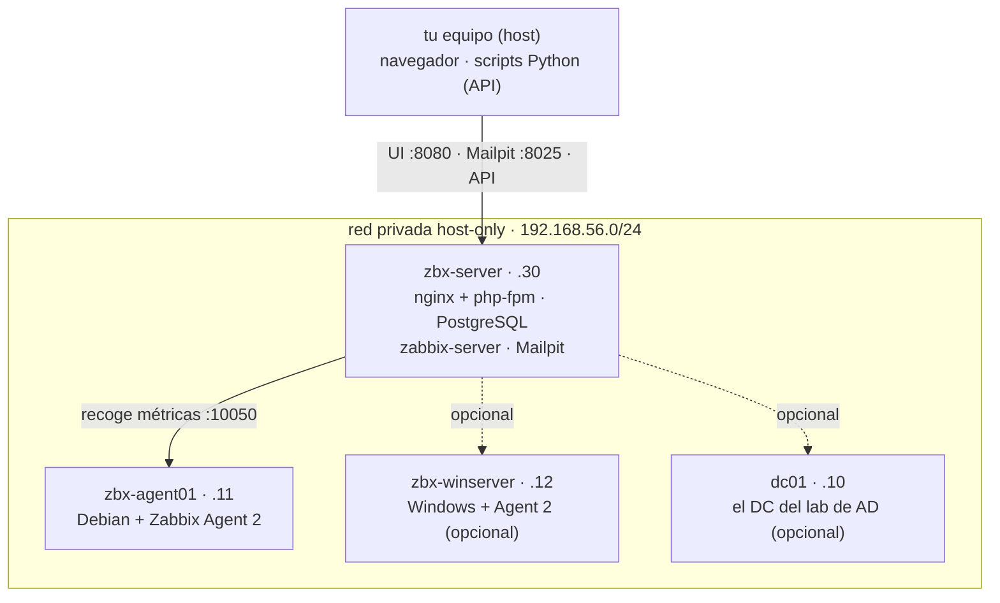
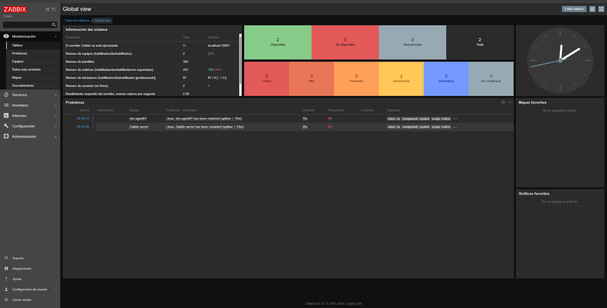
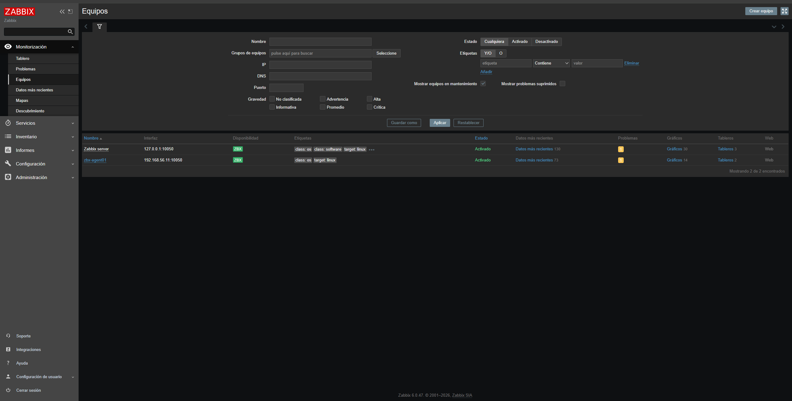
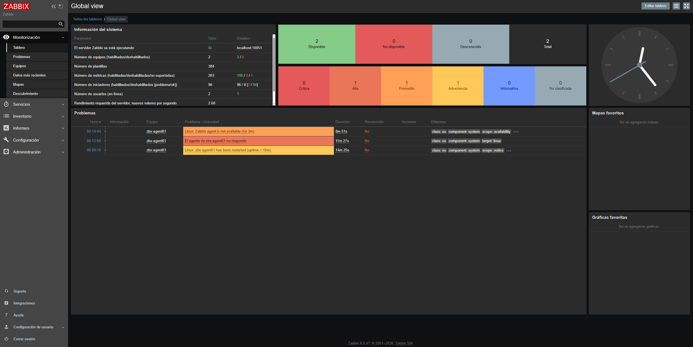

# zabbix-lab

Laboratorio de monitorización con Zabbix 6.0 LTS sobre Debian 12, montado por código. Un `vagrant up` levanta el servidor (Zabbix, PostgreSQL y nginx) y un agente Linux, con el frontend ya configurado sin pasar por el asistente web. Los hosts, los triggers y las notificaciones se dan de alta por API desde archivos declarativos.

Lo monté para no depender de la memoria de nadie al reproducir una monitorización: la infra en texto versionado, la configuración por script y las altas por API. El mismo patrón que se usa en real.

`Vagrant` · `Debian 12` · `Zabbix 6.0 LTS` · `PostgreSQL` · `Python`

> **Entorno de laboratorio. No usar en producción.** Contraseñas triviales a propósito (frontend `Admin`/`zabbix`, base de datos `zabbix`/`zabbix`) y un buzón de pruebas (Mailpit) en lugar de un SMTP real.

## Índice

- [Topología](#topología)
- [Requisitos](#requisitos)
- [Levantarlo](#levantarlo)
- [Estructura](#estructura)
- [Qué se monitoriza](#qué-se-monitoriza)
- [Notificaciones](#notificaciones)
- [Host Windows y el DC del lab de AD](#host-windows-y-el-dc-del-lab-de-ad)
- [Problemas conocidos](#problemas-conocidos)
- [Notas](#notas)
- [Roadmap](#roadmap)

## Topología

El servidor recoge métricas de los agentes por la red privada. Tú hablas con él desde el host: el navegador para la UI y Mailpit, los scripts de Python para la API.



`zbx-winserver` y `dc01` no arrancan con el `vagrant up` normal. El servidor y el agente Linux van solos.

## Requisitos

- VirtualBox.
- Vagrant.
- Unos 2 GB de RAM para el lab Linux (servidor más agente). Otros 2 GB si además levantas el host Windows.

## Levantarlo

```bash
vagrant up      # la primera vez baja la box de Debian
```

El frontend queda en `http://localhost:8080` (login `Admin` / `zabbix`), ya configurado por el provisioning. No hay que pasar por el asistente web: el propio script genera `zabbix.conf.php`.

A partir de ahí, todo se configura por API:

```bash
cd scripts
pip install -r requirements.txt
python alta_hosts.py         # da de alta los hosts de hosts.json
python monitorizacion.py     # crea los items y triggers
python notificaciones.py     # correo (Mailpit) y, si quieres, Telegram
```



Comandos que uso a menudo:

```bash
vagrant status
vagrant provision zbx-server   # reejecuta el provisioning tras editar un .sh
vagrant ssh zbx-server
vagrant destroy -f             # borra el lab entero
```

## Estructura

```
zabbix-lab/
├── Vagrantfile                 server + agente Linux (+ Windows opcional)
├── provision/
│   ├── comun.sh                base común a las VMs Linux
│   ├── servidor.sh             Zabbix server + PostgreSQL + frontend nginx
│   ├── agente.sh               zabbix-agent2 (Linux) apuntando al server
│   ├── correo.sh               Mailpit, el buzón de pruebas
│   └── agente-windows.ps1      Zabbix Agent 2 en Windows Server (WinRM)
├── scripts/
│   ├── alta_hosts.py           alta de hosts por API (idempotente)
│   ├── monitorizacion.py       items y triggers por API
│   ├── notificaciones.py       correo y Telegram por API
│   ├── hosts.json              qué monitorizar (declarativo)
│   ├── notify.local.json.example   plantilla del token de Telegram
│   └── requirements.txt
└── docs/                       capturas del README
```

## Qué se monitoriza

`monitorizacion.py` crea por API los items y los triggers: agente caído, disco por encima del 85%, carga de CPU sostenida, memoria baja y el PostgreSQL del servidor si deja de escuchar. Aquí es donde se decide qué se vigila, que es la parte que instalar Zabbix no te da hecha.

Los hosts salen de `hosts.json`, una entrada por equipo:

```json
{ "name": "zbx-agent01", "ip": "192.168.56.11", "group": "Lab/Linux",
  "os": "linux", "templates": ["Linux by Zabbix agent"], "port": 10050 }
```

Añades la entrada y `alta_hosts.py` crea el host; `monitorizacion.py` mira el campo `os` para decidir qué checks le pone. Los dos son idempotentes.



Para ver saltar una alerta, paro un agente a propósito:

```bash
vagrant ssh zbx-agent01 -c 'sudo systemctl stop zabbix-agent2'
#   ~2 min después el problema aparece en Monitoring -> Problems
```



## Notificaciones

Un trigger que solo se pinta en el panel no avisa a nadie si nadie lo está mirando. `notificaciones.py` configura por API el media type, el medio del usuario y la acción, para que la alerta salga de Zabbix.

El servidor levanta Mailpit, un buzón de pruebas que captura los correos y los muestra en `http://localhost:8025`. Zabbix entrega en `127.0.0.1:1025` y el aviso aparece ahí al momento, sin cuentas SMTP reales y sin mandar correo de verdad. Al parar y arrancar el agente llegan el aviso y su resuelto.


Telegram es opcional. Copia `scripts/notify.local.json.example` a `notify.local.json` (gitignored) y pon tu bot token y tu chat id; `notificaciones.py` los detecta y conecta el medio. Sin credenciales, el correo funciona igual y Telegram se omite.

## Host Windows y el DC del lab de AD

La monitorización real mezcla Linux y Windows. El lab define un tercer host, `zbx-winserver` (Windows Server Core con Zabbix Agent 2), que no arranca por defecto porque pesa:

```bash
vagrant up zbx-winserver
cd scripts && python alta_hosts.py && python monitorizacion.py
```

El puente con el otro proyecto: el controlador de dominio `dc01` del [lab de Active Directory](https://github.com/yosefnaabid/activedirectory-lab) también entra en la monitorización. Comparten la red privada (`.30` este servidor, `.10` el DC). El agente de Windows se instala pasándole el nombre con el que el DC figura en `hosts.json`:

```powershell
$env:ADLAB_WINRM_USER = 'LAB\vagrant'
vagrant winrm-upload ..\zabbix-lab\provision\agente-windows.ps1 C:\Windows\Temp\zbx-agente.ps1 dc01
vagrant winrm dc01 -c "& C:\Windows\Temp\zbx-agente.ps1 192.168.56.30 dc01"
```

Después, `alta_hosts.py` da de alta `dc01` (ya está en `hosts.json`) y `monitorizacion.py` le pone su trigger. Parar el servicio del agente en el DC dispara la alerta como en cualquier host. Si además tienes montada la integración de [glpi-lab](https://github.com/yosefnaabid/glpi-lab), esa alerta abre un ticket.

## Problemas conocidos

- **El paquete `zabbix-release` caduca por versión.** Si el provisioning se detiene al descargarlo, el propio script te dice qué línea cambiar (una sola, en `provision/servidor.sh`).
- **El agente de Windows se baja por versión fija del CDN de Zabbix.** Si esa release deja de estar disponible y da 404, sube `$AgentVersion` en `provision/agente-windows.ps1` a una 6.0.x vigente.
- **El servidor cambió de `.10` a `.30`.** La `.10` la ocupa el DC del lab de AD. Si tenías el lab levantado de antes: `vagrant reload zbx-server` para la IP nueva y `vagrant provision zbx-agent01` para re-apuntar el agente.
- **Telegram no se versiona.** Sus credenciales van en `scripts/notify.local.json`, que está gitignored.

## Notas

- Login del frontend `Admin` / `zabbix`. Base de datos PostgreSQL `zabbix` / `zabbix`.
- `vagrant destroy -f` borra el lab entero sin dejar rastro.
- Las capturas son de una ejecución real: el panel con los dos hosts, la alerta saltando y el correo en Mailpit.

## Roadmap

Ideas para las siguientes iteraciones, y para enseñar evolución:

- [x] Triggers propios definidos como código (`monitorizacion.py`: alerta de agente caído).
- [x] Notificar las alertas por correo y Telegram (`notificaciones.py` + Mailpit; Telegram opt-in).
- [x] Un segundo agente para monitorizar varias máquinas (host Windows Server).
- [x] Monitorizar el DC real del lab de AD (`dc01` en `hosts.json`, agente por WinRM).
- [x] Una alerta abre ticket en el ITSM: integración con [glpi-lab](https://github.com/yosefnaabid/glpi-lab).
- [ ] Migrar el provisioning de shell a Ansible (`ansible_local`). Es lo siguiente que quiero probar.
